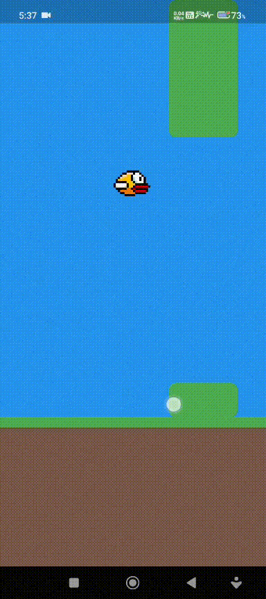

# Flappy Bird Game

Welcome to the Flappy Bird Game project! This project is designed to help beginners learn Flutter by contributing to an open-source game. The game is a simple clone of the classic Flappy Bird, where the player controls a bird to navigate through barriers without hitting them.

## Demo


## Project Overview
This project is built using Flutter, a popular framework for building cross-platform applications. The game logic, UI, and animations are implemented in Dart. Participants will complete the game by implementing missing functions and logic.

## Tasks for Participants
Below are the tasks that need to be completed to make the game functional:

1. **Implement the Game Loop**
   - File: `lib/homepage.dart`
   - Function: `startGame`
   - **Hint:** Use a `Timer` to periodically update the bird's position and barriers. Apply physics equations to simulate gravity and jumping.

2. **Reset the Game**
   - File: `lib/homepage.dart`
   - Function: `resetGame`
   - **Hint:** Reset all game variables to their initial values.

3. **Show Game Over Dialog**
   - File: `lib/homepage.dart`
   - Function: `_showDialog`
   - **Hint:** Use the `showDialog` function to display a dialog when the game ends. Include a restart option.

4. **Implement Jump Logic**
   - File: `lib/homepage.dart`
   - Function: `jump`
   - **Hint:** Reset the time and update the bird's initial position to simulate a jump.

5. **Check if the Bird is Dead**
   - File: `lib/homepage.dart`
   - Function: `birdisDead`
   - **Hint:** Return `true` if the bird goes out of bounds.

## How to Contribute
1. Fork this repository.
2. Clone your forked repository to your local machine.
3. Open the project in your favorite IDE (e.g., VS Code, Android Studio).
4. Navigate to the `lib/homepage.dart` file and complete the missing functions.
5. Test your changes by running the app on an emulator or physical device.
6. Commit your changes and push them to your forked repository.
7. Create a pull request to the main repository.

### Pull Request Guidelines
- For each task or feature, please raise a **separate pull request (PR)**.
- Ensure that your PR includes a clear description of the changes you made.
- Reference the issue number (if applicable) in your PR description.
- Test your changes thoroughly before submitting the PR.

This helps maintain a clean and organized contribution process. Thank you for your efforts!

## How to Clone This Repository
To get started with this project, you need to clone the repository to your local machine. Follow these steps:

1. Open your terminal.
2. Run the following command:
   ```bash
   git clone https://github.com/your-username/flappy_bird_game.git
   ```
3. Navigate to the project directory:
   ```bash
   cd flappy_bird_game
   ```
4. Update the homepage.dart file according to the given tasks

## Prerequisites
- Install Flutter: [Flutter Installation Guide](https://flutter.dev/docs/get-started/install)
- Basic understanding of Dart and Flutter (not mandatory; hints are provided).


## Running the Project
1. Ensure Flutter is installed and set up on your system.
2. Run the following commands in your terminal:
   ```bash
   flutter pub get
   flutter run
   ```

## Missing Features
This game is a work in progress, and there are some features that are not yet implemented:

1. **Barrier Code Implementation**
   - The logic for dynamically generating barriers and their movement is incomplete.

2. **Score Monitoring**
   - A scoring system to track the player's progress is missing.

### How You Can Contribute
- You can raise issues for these missing features or any other bugs you find.
- If you'd like to work on a feature, comment on the issue and request to be assigned.
- Once you complete the feature, submit a pull request (PR) for review.

We encourage you to contribute and make this project even better!

## Additional Notes
- Feel free to ask questions or seek help during the festival.
- Have fun and enjoy learning Flutter!

## License
This project is open-source and available under the [MIT License](./LICENSE).
